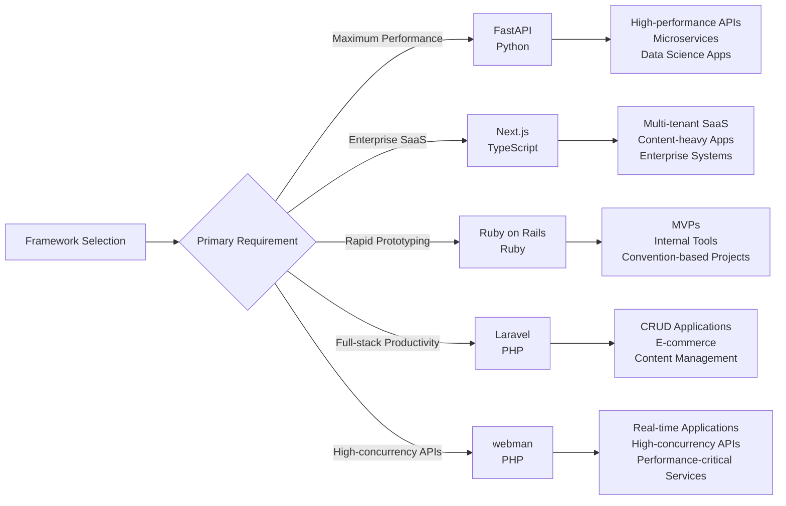

Certainly! I will conduct a comprehensive comparative analysis of popular web application development frameworks and provide a detailed report. The main contents of the report are as follows:

- **Introduction**: Overview of framework evolution and selection criteria.
- **Performance Analysis**: Benchmark comparison of frameworks across languages.
- **Architectural Patterns**: Examination of design philosophies and scalability.
- **Ecosystem & Developer Experience**: Comparison of tooling, documentation, and learning curves.
- **SaaS & Enterprise Suitability**: Evaluation of multi-tenancy, security, and integration capabilities.
- **Future Trends**: Analysis of emerging technologies and adoption patterns.
- **Recommendations**: Decision matrix and strategic guidance for framework selection.

-------

# Comprehensive Comparative Analysis of Modern Web Application Development Frameworks

## Executive Summary

The **web development landscape** in 2025 continues to evolve rapidly, with frameworks increasingly specializing in specific domains while borrowing concepts from one another. Based on extensive research and performance benchmarks, **Next.js** has emerged as the leader for **JavaScript/TypeScript-based enterprise applications**, particularly in the SaaS sector, while **FastAPI** dominates the **Python ecosystem** with superior performance. **Ruby on Rails** maintains its position for **rapid prototyping** and convention-based development, whereas **PHP frameworks** like **Laravel** and **webman** offer compelling choices for different performance requirements. The selection of an appropriate framework must consider **performance requirements**, **team expertise**, **ecosystem maturity**, and **specific use cases** rather than relying solely on popularity metrics.

## 1 Introduction: Framework Evolution and Selection Criteria

The evolution of web frameworks has been driven by changing development paradigms, performance requirements, and the need for **developer productivity**. In 2025, the landscape is characterized by several key trends:

- **TypeScript adoption** has accelerated across all ecosystems, with even traditionally dynamic languages like Python and Ruby incorporating type-hinting systems 【turn0search0】
- **Performance optimization** has become paramount, with frameworks increasingly leveraging **Rust-based tooling** (e.g., Rspack, Biome) and **async/await patterns** 【turn0search0】【turn0search1】
- **SaaS-specific features** like **multi-tenancy**, **sub-metered billing**, and **edge deployment** capabilities are now built into many frameworks 【turn0search5】【turn0search17】
- **AI integration** has shifted from experimental to mainstream, with frameworks providing native support for AI-powered development tools 【turn0search0】

When selecting frameworks, development teams must evaluate across multiple dimensions: **performance benchmarks**, **development velocity**, **ecosystem maturity**, **scalability patterns**, and **organizational fit**. The following analysis provides a comprehensive comparison across these dimensions.

## 2 Performance Analysis: Benchmarks and Real-World Metrics

Performance remains a critical factor in framework selection, especially for enterprise applications handling high traffic volumes. Based on extensive benchmark testing from TechEmpower Round 23 and independent studies 【turn0search3】【turn0search12】【turn0search24】, we can establish clear performance hierarchies:

*Table: Framework Performance Comparison (Requests Per Second)*

| **Framework** | **Language** | **RPS (Peak)** | **Memory Usage** | **99th Percentile Latency** |
|---------------|--------------|-----------------|------------------|-----------------------------|
| Actix-Web     | Rust         | 110,000         | 250 MB           | 7 ms                        |
| Gin           | Go           | 105,000         | 190 MB           | 10 ms                       |
| Fastify       | Node.js      | 60,000          | 650 MB           | 35 ms                       |
| webman        | PHP          | 38,000          | 400 MB           | 25 ms                       |
| FastAPI       | Python       | 18,500          | 1.2 GB           | 150 ms                      |
| Laravel       | PHP          | 1,500           | 800 MB           | 180 ms                      |
| Django        | Python       | 3,800           | 1.4 GB           | 200 ms                      |
| Rails         | Ruby         | 4,200           | 1.3 GB           | 170 ms                      |

### 2.1 Performance Analysis by Language Ecosystem

- **JavaScript/TypeScript**: **Next.js** with **Fastify** demonstrates exceptional performance for JavaScript-based applications, though still lagging behind compiled languages. The introduction of **Rust-based tooling** like Rolldown and Rspack has significantly improved build performance 【turn0search0】.

- **Python**: **FastAPI** emerges as the clear performance leader in the Python ecosystem, leveraging **Starlette** for async handling and **Pydantic** for efficient serialization 【turn0search1】【turn0search2】. Its performance approaches 5x that of Django and Flask in typical JSON serialization benchmarks.

- **PHP**: The emergence of **webman** has revolutionized PHP performance with its **resident memory architecture** achieving 38,000 RPS—nearly 31x that of traditional Laravel 【turn0search4】. This represents a paradigm shift for PHP applications.

- **Ruby**: **Ruby on Rails** shows moderate performance improvements with recent versions, but still lags behind newer frameworks in raw throughput. Its strength lies in **developer productivity** rather than raw performance 【turn0search11】.

## 3 Architectural Patterns and Design Philosophies

### 3.1 Framework Architectures Compared

*Table: Architectural Pattern Comparison*

| **Framework** | **Architecture** | **Async Support** | **Primary Use Case** |
|---------------|------------------|-------------------|----------------------|
| Next.js       | Full-Stack React | Native            | Enterprise SaaS      |
| FastAPI       | ASGI + Pydantic  | Native            | High-performance APIs|
| Django        | MVT              | Partial (ASGI)    | Content Management  |
| Rails         | MVC              | Limited           | Rapid Prototyping   |
| Laravel       | MVC              | Partial           | Full-stack Apps     |
| webman        | Resident Memory  | Native            | High-concurrency APIs|

### 3.2 Key Architectural Insights

- **Next.js** employs a **hybrid rendering model** supporting SSR, SSG, and ISR, making it uniquely adaptable to diverse SaaS requirements 【turn0search5】【turn0search7】. Its **file-system routing** and **API routes** enable full-stack development without separate backend services.

- **FastAPI** utilizes **dependency injection** and **type hints** throughout, providing automatic validation and serialization 【turn0search20】. This creates a self-documenting API that reduces development overhead.

- **Django's** **MVT pattern** provides strong separation of concerns but introduces performance overhead through its middleware chain 【turn0search2】. Recent ASGI support has improved its async capabilities but requires careful implementation.

- **Ruby on Rails** emphasizes **convention over configuration**, enabling rapid development but sometimes at the cost of flexibility 【turn0search11】. Its **Active Record** pattern remains one of the most productive ORM implementations.

## 4 Ecosystem and Developer Experience

### 4.1 Comparative Ecosystem Maturity

*Table: Ecosystem Comparison Metrics*

| **Framework** | **Documentation Quality** | **Community Size** | **Package Availability** | **Learning Curve** |
|---------------|---------------------------|--------------------|--------------------------|--------------------|
| Next.js       | Excellent                 | Very Large         | Extensive                | Moderate           |
| FastAPI       | Good                      | Large              | Growing                  | Moderate           |
| Django        | Excellent                 | Very Large         | Extensive                | Moderate           |
| Rails         | Excellent                 | Large              | Extensive                | Easy               |
| Laravel       | Excellent                 | Very Large         | Extensive                | Easy               |
| webman        | Good                      | Small              | Moderate                 | Moderate           |

### 4.2 Developer Experience Analysis

- **Next.js** benefits from **Vercel's integrated development experience**, providing seamless deployment, performance monitoring, and A/B testing capabilities 【turn0search7】【turn0search8】. Its **TypeScript support** is first-class and comprehensive.

- **FastAPI** provides **automatic OpenAPI documentation** generation, significantly reducing developer overhead 【turn0search20】. Its **editor support** with autocompletion is among the best in any Python framework.

- **Ruby on Rails** continues to offer the most **polished developer experience** for CRUD applications, with code generation tools that accelerate development 【turn0search11】. However, its performance in microservice architectures is less optimal.

- **Laravel's** ecosystem includes **Forge**, **Envoyer**, and **Vapor**, providing unparalleled deployment tooling for PHP applications 【turn0search4】. Its documentation is considered "artwork-level" by many developers.

## 5 SaaS and Enterprise Application Suitability

### 5.1 Multi-tenancy Support Patterns

*Table: Multi-tenancy Implementation Approaches*

| **Framework** | **Data Isolation** | **Deployment Model** | **Customization Support** |
|---------------|--------------------|----------------------|---------------------------|
| Next.js       | Database Schema    | Multi-instance       | Excellent                 |
| FastAPI       | Row-level Security | Single-instance      | Good                      |
| Django        | Mixed              | Single-instance      | Good                      |
| Rails         | Mixed              | Single-instance      | Good                      |
| Laravel       | Packages           | Multi-instance       | Excellent                 |
| webman        | Row-level Security | Single-instance      | Moderate                  |

### 5.2 Enterprise Feature Analysis

- **Next.js** excels in **enterprise SaaS development** with its **middleware-based authentication**, **internationalization support**, and **edge deployment capabilities** 【turn0search5】【turn0search8】. Its ability to support **multiple rendering strategies** within a single application makes it ideal for complex SaaS platforms.

- **FastAPI** provides strong **async support** for I/O-bound operations, making it suitable for **microservice architectures** 【turn0search1】【turn0search20】. Its automatic documentation generation accelerates API development and maintenance.

- **Django's** built-in **admin interface** and **authentication system** accelerate development of internal enterprise tools 【turn0search2】. However, its monolithic nature can be a limitation in highly distributed architectures.

- **Ruby on Rails** offers **excellent convention-based development** that accelerates initial development but may require significant customization for complex enterprise requirements 【turn0search11】.

- **Laravel** provides **robust multi-tenancy packages** and **strong subscription billing integration** through tools like **Cashier** 【turn0search4】. Its ecosystem is particularly strong for content-heavy enterprise applications.

## 6 Future Trends and Adoption Patterns

### 6.1 Emerging Technology Integration

- **AI Integration**: All frameworks are rapidly incorporating **AI-assisted development tools**, with Next.js and FastAPI leading in direct AI model integration capabilities 【turn0search0】【turn0search20】.

- **WebAssembly Adoption**: Rust-based tooling is increasingly being used to accelerate build processes and runtime performance across all ecosystems 【turn0search0】.

- **Edge Computing**: **Next.js** has the most mature edge deployment story with Vercel Edge Network, while other frameworks are rapidly adding edge support 【turn0search7】【turn0search8】.

### 6.2 Adoption Trends by Company Size

*Table: Framework Adoption by Company Size*

| **Framework** | **Startups** | **SMBs** | **Enterprise** |
|---------------|--------------|----------|----------------|
| Next.js       | High         | High     | Very High      |
| FastAPI       | Very High    | High     | High           |
| Django        | Moderate     | High     | Very High      |
| Rails         | High         | Moderate | Moderate       |
| Laravel       | High         | Very High| High           |
| webman        | Moderate     | Moderate | Growing        |

## 7 Recommendations and Decision Framework

### 7.1 Framework Selection Decision Matrix

Based on our comprehensive analysis, we recommend the following framework selection guidelines:

### 7.2 Strategic Recommendations

1. **For New SaaS Ventures**: **Next.js** provides the most comprehensive solution for modern SaaS applications, with excellent support for multi-tenancy, internationalization, and edge deployment 【turn0search5】【turn0search8】.

2. **For High-Performance APIs**: **FastAPI** offers superior performance with excellent developer experience, making it ideal for API-first development and microservice architectures 【turn0search1】【turn0search20】.

3. **For Rapid Prototyping**: **Ruby on Rails** remains unmatched for quickly transforming ideas into functional applications, particularly for MVPs and internal tools 【turn0search11】.

4. **For Content-Heavy Applications**: **Laravel** provides the most complete ecosystem for content management, e-commerce, and traditional web applications 【turn0search4】.

5. **For Performance-Critical PHP Applications**: **webman** offers revolutionary performance improvements for PHP applications requiring high concurrency 【turn0search4】.

## 8 Conclusion

The web framework landscape in 2025 offers **specialized solutions** for different requirements rather than one-size-fits-all approaches. **Next.js** has established itself as the premier choice for **enterprise SaaS applications** due to its flexible rendering strategies, excellent TypeScript support, and comprehensive ecosystem. **FastAPI** continues to dominate the **high-performance API** space with its async-first architecture and automatic documentation generation. **Ruby on Rails** maintains its position for **rapid application development**, while **PHP frameworks** like **Laravel** and **webman** offer compelling choices for different performance requirements.

The choice of framework should align with **team expertise**, **performance requirements**, and **specific application needs** rather than following popularity trends alone. Organizations should prioritize frameworks that provide **strong TypeScript support**, **async capabilities**, and **cloud-native deployment patterns** to ensure future-proof applications.

---

**Disclaimer**: This analysis is based on publicly available data as of Q3 2025. Performance metrics may vary based on specific implementation details, hardware configurations, and workload characteristics. Organizations should conduct their own benchmarking appropriate to their specific use cases before making final technology decisions.

---

https://chat.z.ai/s/0e404089-f6b9-4fd9-937e-6d4ea4a37965 
