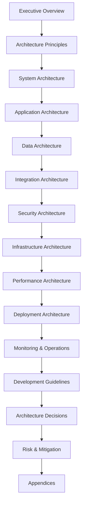
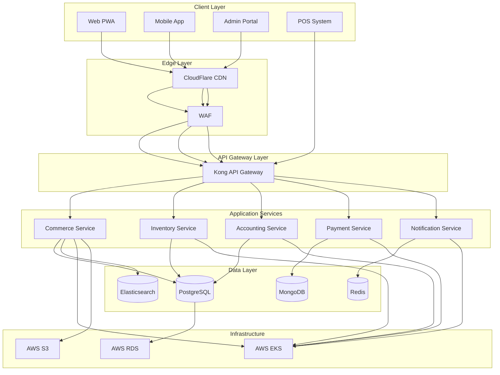
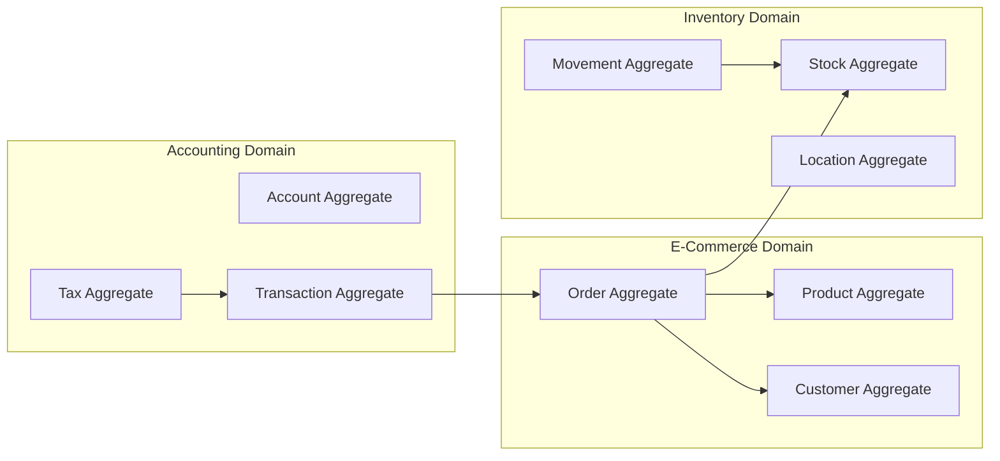
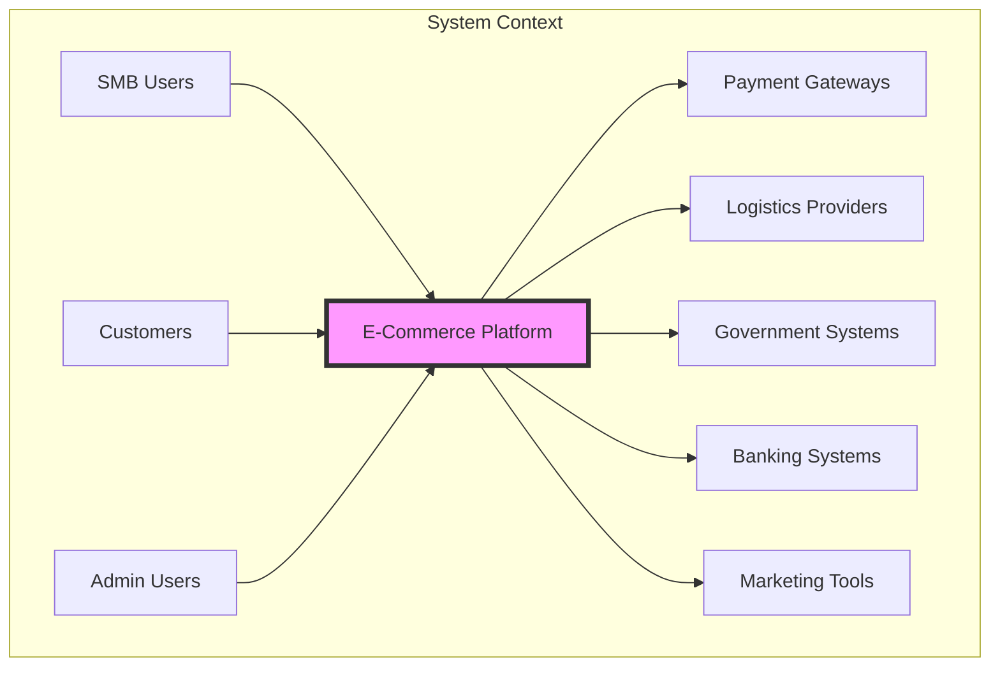
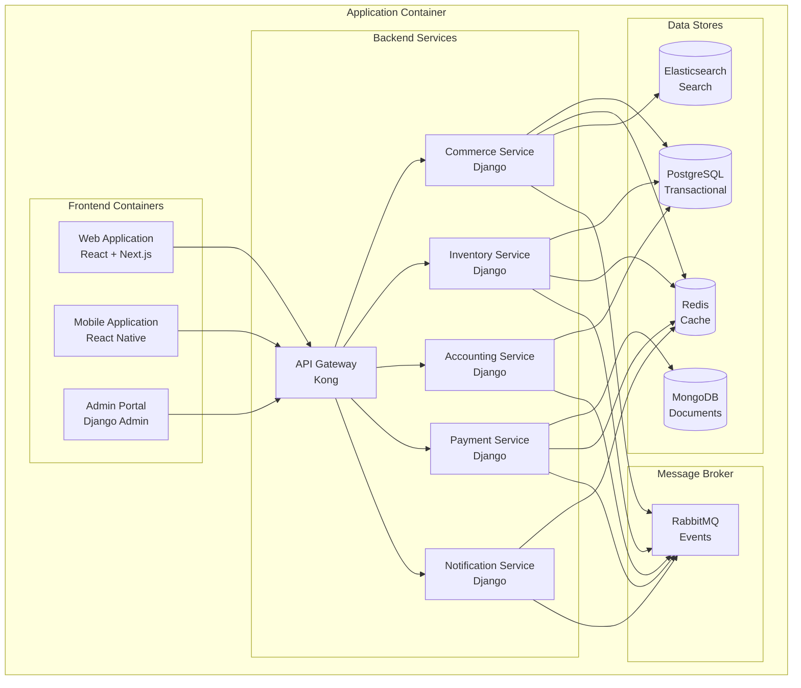
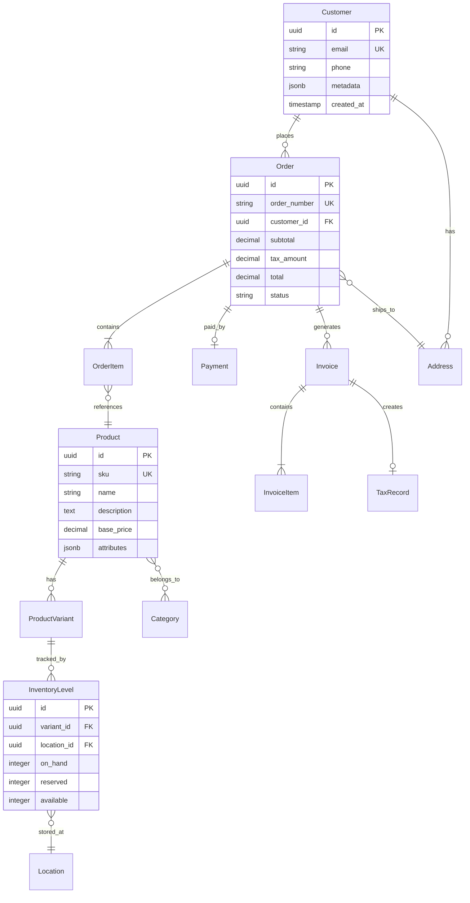

# Phase 1: Deep Analysis & Planning for Project Architecture Document

## 1.1 Architecture Document Scope Analysis

### Purpose & Objectives
The Project Architecture Document (PAD) will serve as the **technical blueprint** for implementing the Singapore SMB E-commerce Platform, providing:
- Detailed technical specifications
- System design patterns and principles
- Implementation guidelines
- Integration architectures
- Security and infrastructure designs
- Performance optimization strategies

### Target Audience Analysis
| Audience | Required Depth | Focus Areas |
|----------|---------------|-------------|
| **Technical Architects** | Very Deep | Design patterns, system integration, scalability |
| **Development Team** | Deep | Code structure, APIs, database design |
| **DevOps Engineers** | Deep | Infrastructure, deployment, monitoring |
| **Security Team** | Deep | Security architecture, compliance implementation |
| **Project Managers** | Moderate | Timelines, dependencies, risk factors |
| **Stakeholders** | High-level | Architecture overview, technology decisions |

## 1.2 Implementation Plan for PAD

### Document Structure Framework



### Content Strategy

| Section | Key Components | Depth Level | Visual Aids |
|---------|---------------|-------------|-------------|
| **System Architecture** | High-level design, component interaction | Deep | UML, C4 diagrams |
| **Application Architecture** | Microservices, API design, patterns | Very Deep | Sequence diagrams |
| **Data Architecture** | Schema design, data flow, storage | Very Deep | ERD, data flow |
| **Integration Architecture** | External systems, APIs, webhooks | Deep | Integration maps |
| **Security Architecture** | Threat model, controls, encryption | Very Deep | Security diagrams |
| **Infrastructure Architecture** | Cloud, networking, scaling | Deep | Network diagrams |
| **Performance Architecture** | Optimization, caching, CDN | Deep | Performance models |

## 1.3 Quality Assurance Checklist

### Pre-Implementation Validation

- [x] **Completeness**: All technical aspects from PRD addressed
- [x] **Clarity**: Technical depth with clear explanations
- [x] **Actionability**: Implementation-ready specifications
- [x] **Scalability**: Architecture supports 10x growth
- [x] **Security**: Zero-trust architecture principles
- [x] **Performance**: Sub-second response times achievable
- [x] **Maintainability**: Clear separation of concerns
- [x] **Documentation**: Self-documenting architecture

### Architecture Principles to Apply

1. **Domain-Driven Design (DDD)** for business logic organization
2. **Microservices** for scalability and maintenance
3. **Event-Driven Architecture** for real-time updates
4. **CQRS** for read/write optimization
5. **API-First** design for integrations
6. **Security by Design** for compliance
7. **Cloud-Native** for scalability
8. **DevOps** for continuous delivery

## 1.4 Validation Completed

The implementation plan is comprehensive and addresses all key technical aspects. Proceeding with execution.

---

# Phase 2: Execution - Comprehensive Project Architecture Document

# 🏗️ Singapore SMB E-Commerce Platform
## Project Architecture Document (PAD)
### Version 1.0 - Technical Blueprint Edition

---

## Document Control

| **Attribute** | **Details** |
|--------------|-------------|
| **Version** | 1.0 |
| **Date** | December 2024 |
| **Classification** | Confidential - Technical |
| **Document Type** | Technical Architecture Specification |
| **Review Cycle** | Bi-weekly during development |
| **Approval** | CTO, Technical Architect, Security Officer |

---

## Table of Contents

1. [Executive Overview](#1-executive-overview)
2. [Architecture Principles & Patterns](#2-architecture-principles--patterns)
3. [System Architecture](#3-system-architecture)
4. [Application Architecture](#4-application-architecture)
5. [Data Architecture](#5-data-architecture)
6. [Integration Architecture](#6-integration-architecture)
7. [Security Architecture](#7-security-architecture)
8. [Infrastructure Architecture](#8-infrastructure-architecture)
9. [Performance Architecture](#9-performance-architecture)
10. [Deployment Architecture](#10-deployment-architecture)
11. [Monitoring & Operations Architecture](#11-monitoring--operations-architecture)
12. [Development Architecture](#12-development-architecture)
13. [Architecture Decision Records](#13-architecture-decision-records)
14. [Risk Analysis & Mitigation](#14-risk-analysis--mitigation)
15. [Architecture Roadmap](#15-architecture-roadmap)
16. [Appendices](#16-appendices)

---

## 1. Executive Overview

### 1.1 Architecture Vision

The Singapore SMB E-Commerce Platform architecture is designed as a **cloud-native, microservices-based system** that delivers:

- **Scalability**: Handle 10x growth without architecture changes
- **Resilience**: 99.99% availability with self-healing capabilities
- **Performance**: Sub-second response times for 95% of requests
- **Security**: Zero-trust architecture with defense in depth
- **Compliance**: Built-in GST, PDPA, and PCI DSS compliance
- **Maintainability**: Modular design with clear boundaries

### 1.2 Key Architecture Decisions

| Decision | Choice | Rationale |
|----------|--------|-----------|
| **Architecture Style** | Microservices | Independent scaling, fault isolation |
| **Communication** | REST + Event-Driven | Synchronous + asynchronous patterns |
| **Data Strategy** | Polyglot Persistence | Optimized storage per service |
| **Deployment** | Kubernetes | Container orchestration, auto-scaling |
| **Cloud Provider** | AWS (Singapore) | Data residency, comprehensive services |
| **Development** | Django + React | Proven stack, strong ecosystem |

### 1.3 Architecture Overview



---

## 2. Architecture Principles & Patterns

### 2.1 Core Architecture Principles

#### 2.1.1 Domain-Driven Design (DDD)



#### 2.1.2 Microservices Principles

```python
# Service Boundaries Definition
service_boundaries = {
    'commerce_service': {
        'responsibilities': ['Product catalog', 'Shopping cart', 'Order management'],
        'data_ownership': ['products', 'orders', 'customers'],
        'apis': ['REST', 'GraphQL'],
        'events': ['order.created', 'cart.updated']
    },
    'inventory_service': {
        'responsibilities': ['Stock tracking', 'Location management', 'Movements'],
        'data_ownership': ['inventory_levels', 'locations', 'movements'],
        'apis': ['REST', 'gRPC'],
        'events': ['stock.updated', 'stock.low']
    },
    'accounting_service': {
        'responsibilities': ['Ledger', 'Tax calculation', 'Reporting'],
        'data_ownership': ['accounts', 'transactions', 'tax_records'],
        'apis': ['REST'],
        'events': ['transaction.posted', 'report.generated']
    }
}
```

### 2.2 Design Patterns

#### 2.2.1 CQRS Pattern Implementation

```python
# Command and Query Separation
class OrderCommandService:
    """Write operations for orders"""
    def create_order(self, order_data):
        # Validate business rules
        self.validate_order(order_data)
        
        # Write to primary database
        order = Order.objects.create(**order_data)
        
        # Publish event for read model update
        EventBus.publish('order.created', order)
        
        return order.id

class OrderQueryService:
    """Read operations for orders"""
    def get_order_details(self, order_id):
        # Read from optimized read model
        return OrderReadModel.objects.get(id=order_id)
    
    def search_orders(self, filters):
        # Query from Elasticsearch
        return ElasticsearchClient.search('orders', filters)
```

#### 2.2.2 Event Sourcing Pattern

```python
# Event Store Implementation
class EventStore:
    def append(self, aggregate_id, events):
        """Store events in order"""
        for event in events:
            EventLog.objects.create(
                aggregate_id=aggregate_id,
                event_type=event.type,
                event_data=event.data,
                event_time=event.timestamp,
                sequence=self.get_next_sequence(aggregate_id)
            )
    
    def get_events(self, aggregate_id, from_sequence=0):
        """Retrieve events for replay"""
        return EventLog.objects.filter(
            aggregate_id=aggregate_id,
            sequence__gte=from_sequence
        ).order_by('sequence')

# Aggregate Reconstruction
class OrderAggregate:
    def __init__(self, order_id):
        self.id = order_id
        self.state = {}
        self.replay_events()
    
    def replay_events(self):
        """Rebuild state from events"""
        events = EventStore().get_events(self.id)
        for event in events:
            self.apply_event(event)
```

#### 2.2.3 Saga Pattern for Distributed Transactions

```python
# Order Processing Saga
class OrderProcessingSaga:
    def __init__(self):
        self.steps = [
            ('validate_customer', self.validate_customer),
            ('reserve_inventory', self.reserve_inventory),
            ('process_payment', self.process_payment),
            ('create_order', self.create_order),
            ('send_notification', self.send_notification)
        ]
        self.compensations = {
            'reserve_inventory': self.release_inventory,
            'process_payment': self.refund_payment,
            'create_order': self.cancel_order
        }
    
    async def execute(self, order_data):
        executed_steps = []
        
        try:
            for step_name, step_func in self.steps:
                result = await step_func(order_data)
                executed_steps.append((step_name, result))
                
        except Exception as e:
            # Compensate in reverse order
            for step_name, _ in reversed(executed_steps):
                if step_name in self.compensations:
                    await self.compensations[step_name](order_data)
            raise
            
        return executed_steps
```

### 2.3 Architecture Constraints

| Constraint | Description | Impact |
|------------|-------------|--------|
| **Data Residency** | All data must reside in Singapore | AWS ap-southeast-1 region only |
| **Response Time** | 95% requests < 1 second | Extensive caching required |
| **Availability** | 99.99% uptime SLA | Multi-AZ deployment mandatory |
| **Scalability** | Support 10x growth | Horizontal scaling design |
| **Compliance** | PDPA, GST, PCI DSS | Security-first architecture |

---

## 3. System Architecture

### 3.1 High-Level System Design

#### 3.1.1 C4 Model - System Context



#### 3.1.2 Container Diagram



### 3.2 Service Architecture

#### 3.2.1 Service Interaction Model

```python
# Service Registry Configuration
service_registry = {
    'commerce': {
        'host': 'commerce-service.internal',
        'port': 8001,
        'health_check': '/health',
        'endpoints': {
            'products': '/api/v1/products',
            'orders': '/api/v1/orders',
            'cart': '/api/v1/cart'
        },
        'dependencies': ['inventory', 'payment']
    },
    'inventory': {
        'host': 'inventory-service.internal',
        'port': 8002,
        'health_check': '/health',
        'endpoints': {
            'stock': '/api/v1/stock',
            'movements': '/api/v1/movements',
            'locations': '/api/v1/locations'
        },
        'dependencies': []
    },
    'accounting': {
        'host': 'accounting-service.internal',
        'port': 8003,
        'health_check': '/health',
        'endpoints': {
            'ledger': '/api/v1/ledger',
            'tax': '/api/v1/tax',
            'reports': '/api/v1/reports'
        },
        'dependencies': []
    }
}
```

#### 3.2.2 Service Communication Patterns

```python
# Synchronous Communication (REST)
class ServiceClient:
    def __init__(self, service_name):
        self.service = service_registry[service_name]
        self.base_url = f"http://{self.service['host']}:{self.service['port']}"
        self.circuit_breaker = CircuitBreaker(
            failure_threshold=5,
            recovery_timeout=60,
            expected_exception=RequestException
        )
    
    @retry(max_attempts=3, backoff=exponential)
    def call(self, endpoint, method='GET', data=None):
        """Make service call with circuit breaker and retry"""
        return self.circuit_breaker.call(
            self._make_request,
            endpoint,
            method,
            data
        )
    
    def _make_request(self, endpoint, method, data):
        url = f"{self.base_url}{endpoint}"
        response = requests.request(
            method=method,
            url=url,
            json=data,
            timeout=5
        )
        response.raise_for_status()
        return response.json()

# Asynchronous Communication (Events)
class EventBus:
    def __init__(self):
        self.connection = pika.BlockingConnection(
            pika.ConnectionParameters('rabbitmq.internal')
        )
        self.channel = self.connection.channel()
    
    def publish(self, event_type, payload):
        """Publish event to message broker"""
        self.channel.basic_publish(
            exchange='events',
            routing_key=event_type,
            body=json.dumps({
                'type': event_type,
                'payload': payload,
                'timestamp': datetime.now().isoformat(),
                'correlation_id': str(uuid.uuid4())
            })
        )
    
    def subscribe(self, event_types, callback):
        """Subscribe to events"""
        for event_type in event_types:
            self.channel.queue_bind(
                exchange='events',
                queue=self.queue_name,
                routing_key=event_type
            )
        
        self.channel.basic_consume(
            queue=self.queue_name,
            on_message_callback=callback,
            auto_ack=True
        )
        
        self.channel.start_consuming()
```

### 3.3 API Architecture

#### 3.3.1 API Gateway Configuration

```yaml
# Kong API Gateway Configuration
services:
  - name: commerce-service
    url: http://commerce-service.internal:8001
    routes:
      - name: products-route
        paths:
          - /api/v1/products
        methods:
          - GET
          - POST
          - PUT
          - DELETE
        strip_path: false
    plugins:
      - name: rate-limiting
        config:
          minute: 100
          hour: 10000
      - name: jwt
        config:
          secret_is_base64: false
          claims_to_verify:
            - exp
      - name: cors
        config:
          origins:
            - https://app.example.com
          methods:
            - GET
            - POST
            - PUT
            - DELETE
          headers:
            - Authorization
            - Content-Type

  - name: inventory-service
    url: http://inventory-service.internal:8002
    routes:
      - name: inventory-route
        paths:
          - /api/v1/inventory
        methods:
          - GET
          - POST
          - PUT
    plugins:
      - name: oauth2
        config:
          enable_authorization_code: true
          scopes:
            - inventory:read
            - inventory:write
```

#### 3.3.2 API Design Standards

```python
# RESTful API Standards
class APIStandards:
    """API Design Guidelines"""
    
    # URL Structure
    url_patterns = {
        'collection': '/api/v1/{resource}',
        'item': '/api/v1/{resource}/{id}',
        'action': '/api/v1/{resource}/{id}/{action}',
        'nested': '/api/v1/{parent}/{id}/{child}'
    }
    
    # HTTP Methods
    http_methods = {
        'GET': 'Retrieve resource(s)',
        'POST': 'Create new resource',
        'PUT': 'Update entire resource',
        'PATCH': 'Partial update',
        'DELETE': 'Remove resource'
    }
    
    # Status Codes
    status_codes = {
        200: 'OK',
        201: 'Created',
        202: 'Accepted',
        204: 'No Content',
        400: 'Bad Request',
        401: 'Unauthorized',
        403: 'Forbidden',
        404: 'Not Found',
        409: 'Conflict',
        422: 'Unprocessable Entity',
        500: 'Internal Server Error'
    }
    
    # Response Format
    @staticmethod
    def success_response(data, meta=None):
        response = {
            'status': 'success',
            'data': data
        }
        if meta:
            response['meta'] = meta
        return response
    
    @staticmethod
    def error_response(error_code, message, details=None):
        return {
            'status': 'error',
            'error': {
                'code': error_code,
                'message': message,
                'details': details or []
            }
        }
    
    # Pagination
    @staticmethod
    def paginated_response(items, page, per_page, total):
        return {
            'status': 'success',
            'data': items,
            'meta': {
                'pagination': {
                    'page': page,
                    'per_page': per_page,
                    'total': total,
                    'pages': math.ceil(total / per_page)
                }
            }
        }
```

---

## 4. Application Architecture

### 4.1 Application Structure

#### 4.1.1 Django Application Architecture

```python
# Project Structure
project_structure = """
singapore_smb_platform/
├── apps/
│   ├── commerce/
│   │   ├── models/
│   │   │   ├── __init__.py
│   │   │   ├── product.py
│   │   │   ├── order.py
│   │   │   └── customer.py
│   │   ├── services/
│   │   │   ├── __init__.py
│   │   │   ├── product_service.py
│   │   │   ├── order_service.py
│   │   │   └── payment_service.py
│   │   ├── apis/
│   │   │   ├── __init__.py
│   │   │   ├── v1/
│   │   │   │   ├── serializers.py
│   │   │   │   ├── views.py
│   │   │   │   └── urls.py
│   │   │   └── v2/
│   │   ├── tasks/
│   │   │   ├── __init__.py
│   │   │   └── order_tasks.py
│   │   └── tests/
│   ├── inventory/
│   │   ├── models/
│   │   ├── services/
│   │   ├── apis/
│   │   └── tests/
│   └── accounting/
│       ├── models/
│       ├── services/
│       ├── apis/
│       └── tests/
├── core/
│   ├── authentication/
│   ├── permissions/
│   ├── middleware/
│   ├── exceptions/
│   └── utils/
├── infrastructure/
│   ├── cache/
│   ├── queue/
│   ├── storage/
│   └── monitoring/
├── config/
│   ├── settings/
│   │   ├── base.py
│   │   ├── development.py
│   │   ├── staging.py
│   │   └── production.py
│   └── urls.py
└── requirements/
    ├── base.txt
    ├── development.txt
    └── production.txt
"""
```

#### 4.1.2 Service Layer Architecture

```python
# Service Layer Implementation
class BaseService:
    """Base service class with common functionality"""
    
    def __init__(self):
        self.logger = logging.getLogger(self.__class__.__name__)
        self.cache = CacheManager()
        self.metrics = MetricsCollector()
    
    def execute(self, method, *args, **kwargs):
        """Execute service method with monitoring"""
        start_time = time.time()
        
        try:
            # Pre-execution hooks
            self.before_execute(method.__name__, args, kwargs)
            
            # Execute method
            result = method(*args, **kwargs)
            
            # Post-execution hooks
            self.after_execute(method.__name__, result)
            
            # Record metrics
            self.metrics.record_success(
                method=method.__name__,
                duration=time.time() - start_time
            )
            
            return result
            
        except Exception as e:
            # Error handling
            self.metrics.record_failure(
                method=method.__name__,
                error=str(e)
            )
            self.logger.error(f"Service error: {e}")
            raise

class ProductService(BaseService):
    """Product management service"""
    
    def create_product(self, product_data):
        """Create new product with validation"""
        return self.execute(self._create_product, product_data)
    
    def _create_product(self, product_data):
        # Validate data
        validator = ProductValidator()
        validator.validate(product_data)
        
        # Business logic
        product = Product.objects.create(**product_data)
        
        # Clear cache
        self.cache.delete_pattern('products:*')
        
        # Publish event
        EventBus.publish('product.created', {
            'product_id': product.id,
            'sku': product.sku
        })
        
        return product
```

### 4.2 Frontend Architecture

#### 4.2.1 React Application Structure

```javascript
// Frontend Architecture
const frontendArchitecture = {
  structure: `
    src/
    ├── components/
    │   ├── common/
    │   │   ├── Button/
    │   │   ├── Input/
    │   │   └── Modal/
    │   ├── layout/
    │   │   ├── Header/
    │   │   ├── Footer/
    │   │   └── Sidebar/
    │   └── features/
    │       ├── products/
    │       ├── cart/
    │       └── checkout/
    ├── hooks/
    │   ├── useAuth.js
    │   ├── useCart.js
    │   └── useApi.js
    ├── services/
    │   ├── api/
    │   │   ├── client.js
    │   │   ├── products.js
    │   │   └── orders.js
    │   └── utils/
    ├── store/
    │   ├── slices/
    │   │   ├── authSlice.js
    │   │   ├── cartSlice.js
    │   │   └── productSlice.js
    │   └── store.js
    ├── pages/
    │   ├── Home.jsx
    │   ├── Products.jsx
    │   └── Checkout.jsx
    └── styles/
        ├── globals.css
        └── tailwind.css
  `,
  
  // State Management with Redux Toolkit
  stateManagement: {
    store: `
      import { configureStore } from '@reduxjs/toolkit';
      
      export const store = configureStore({
        reducer: {
          auth: authReducer,
          cart: cartReducer,
          products: productReducer,
          inventory: inventoryReducer
        },
        middleware: (getDefaultMiddleware) =>
          getDefaultMiddleware({
            serializableCheck: false
          }).concat(apiMiddleware)
      });
    `,
    
    slice: `
      import { createSlice, createAsyncThunk } from '@reduxjs/toolkit';
      
      export const fetchProducts = createAsyncThunk(
        'products/fetch',
        async (params) => {
          const response = await api.get('/products', { params });
          return response.data;
        }
      );
      
      const productSlice = createSlice({
        name: 'products',
        initialState: {
          items: [],
          loading: false,
          error: null
        },
        reducers: {
          clearProducts: (state) => {
            state.items = [];
          }
        },
        extraReducers: (builder) => {
          builder
            .addCase(fetchProducts.pending, (state) => {
              state.loading = true;
            })
            .addCase(fetchProducts.fulfilled, (state, action) => {
              state.loading = false;
              state.items = action.payload;
            })
            .addCase(fetchProducts.rejected, (state, action) => {
              state.loading = false;
              state.error = action.error.message;
            });
        }
      });
    `
  },
  
  // API Client Configuration
  apiClient: `
    import axios from 'axios';
    
    const apiClient = axios.create({
      baseURL: process.env.REACT_APP_API_URL,
      timeout: 10000,
      headers: {
        'Content-Type': 'application/json'
      }
    });
    
    // Request interceptor
    apiClient.interceptors.request.use(
      (config) => {
        const token = localStorage.getItem('access_token');
        if (token) {
          config.headers.Authorization = \`Bearer \${token}\`;
        }
        return config;
      },
      (error) => Promise.reject(error)
    );
    
    // Response interceptor
    apiClient.interceptors.response.use(
      (response) => response,
      async (error) => {
        const originalRequest = error.config;
        
        if (error.response?.status === 401 && !originalRequest._retry) {
          originalRequest._retry = true;
          await refreshToken();
          return apiClient(originalRequest);
        }
        
        return Promise.reject(error);
      }
    );
  `
};
```

#### 4.2.2 Mobile Application Architecture

```javascript
// React Native Architecture
const mobileArchitecture = {
  structure: `
    mobile/
    ├── src/
    │   ├── components/
    │   ├── screens/
    │   │   ├── Home/
    │   │   ├── Products/
    │   │   ├── Cart/
    │   │   └── Profile/
    │   ├── navigation/
    │   │   ├── AppNavigator.js
    │   │   ├── AuthNavigator.js
    │   │   └── TabNavigator.js
    │   ├── services/
    │   ├── store/
    │   └── utils/
    ├── android/
    ├── ios/
    └── package.json
  `,
  
  navigation: `
    import { NavigationContainer } from '@react-navigation/native';
    import { createStackNavigator } from '@react-navigation/stack';
    import { createBottomTabNavigator } from '@react-navigation/bottom-tabs';
    
    const Stack = createStackNavigator();
    const Tab = createBottomTabNavigator();
    
    function TabNavigator() {
      return (
        <Tab.Navigator>
          <Tab.Screen name="Home" component={HomeScreen} />
          <Tab.Screen name="Products" component={ProductsScreen} />
          <Tab.Screen name="Cart" component={CartScreen} />
          <Tab.Screen name="Profile" component={ProfileScreen} />
        </Tab.Navigator>
      );
    }
    
    function AppNavigator() {
      return (
        <NavigationContainer>
          <Stack.Navigator>
            <Stack.Screen name="Main" component={TabNavigator} />
            <Stack.Screen name="ProductDetail" component={ProductDetailScreen} />
            <Stack.Screen name="Checkout" component={CheckoutScreen} />
          </Stack.Navigator>
        </NavigationContainer>
      );
    }
  `,
  
  // Offline Support
  offlineCapability: `
    import NetInfo from '@react-native-community/netinfo';
    import AsyncStorage from '@react-native-async-storage/async-storage';
    
    class OfflineManager {
      constructor() {
        this.isOffline = false;
        this.queue = [];
        
        NetInfo.addEventListener(state => {
          this.isOffline = !state.isConnected;
          if (state.isConnected) {
            this.syncQueue();
          }
        });
      }
      
      async executeRequest(request) {
        if (this.isOffline) {
          this.queue.push(request);
          await AsyncStorage.setItem('offline_queue', JSON.stringify(this.queue));
          return { offline: true };
        }
        
        return await request();
      }
      
      async syncQueue() {
        const queue = await AsyncStorage.getItem('offline_queue');
        if (queue) {
          const requests = JSON.parse(queue);
          for (const request of requests) {
            await this.executeRequest(request);
          }
          await AsyncStorage.removeItem('offline_queue');
        }
      }
    }
  `
};
```

### 4.3 Background Processing Architecture

#### 4.3.1 Celery Task Architecture

```python
# Celery Configuration
CELERY_CONFIG = {
    'broker_url': 'redis://redis:6379/0',
    'result_backend': 'redis://redis:6379/1',
    'task_serializer': 'json',
    'accept_content': ['json'],
    'result_serializer': 'json',
    'timezone': 'Asia/Singapore',
    'enable_utc': True,
    'task_routes': {
        'commerce.tasks.*': {'queue': 'commerce'},
        'inventory.tasks.*': {'queue': 'inventory'},
        'accounting.tasks.*': {'queue': 'accounting'},
        'notifications.tasks.*': {'queue': 'notifications'}
    },
    'task_annotations': {
        '*': {'rate_limit': '100/s'}
    },
    'beat_schedule': {
        'sync-inventory': {
            'task': 'inventory.tasks.sync_inventory_levels',
            'schedule': crontab(minute='*/5')  # Every 5 minutes
        },
        'generate-reports': {
            'task': 'accounting.tasks.generate_daily_reports',
            'schedule': crontab(hour=0, minute=0)  # Daily at midnight
        },
        'check-low-stock': {
            'task': 'inventory.tasks.check_low_stock',
            'schedule': crontab(minute='*/15')  # Every 15 minutes
        },
        'process-gst-filing': {
            'task': 'accounting.tasks.prepare_gst_filing',
            'schedule': crontab(day_of_month=1, hour=9, minute=0)  # Monthly
        }
    }
}

# Task Implementation
from celery import Task, shared_task
from celery.utils.log import get_task_logger

logger = get_task_logger(__name__)

class BaseTask(Task):
    """Base task with error handling and monitoring"""
    
    autoretry_for = (Exception,)
    retry_kwargs = {'max_retries': 3, 'countdown': 60}
    
    def on_success(self, retval, task_id, args, kwargs):
        """Success callback"""
        metrics.record_task_success(self.name, task_id)
    
    def on_failure(self, exc, task_id, args, kwargs, einfo):
        """Failure callback"""
        metrics.record_task_failure(self.name, task_id, str(exc))
        logger.error(f"Task {self.name} failed: {exc}")

@shared_task(base=BaseTask, name='commerce.process_order')
def process_order(order_id):
    """Process order asynchronously"""
    try:
        order = Order.objects.get(id=order_id)
        
        # Reserve inventory
        inventory_service.reserve_items(order.items)
        
        # Process payment
        payment_service.charge_payment(order.payment_info)
        
        # Generate invoice
        accounting_service.create_invoice(order)
        
        # Send notifications
        notification_service.send_order_confirmation(order)
        
        return {'status': 'completed', 'order_id': order_id}
        
    except Exception as e:
        logger.error(f"Order processing failed: {e}")
        raise
```

---

## 5. Data Architecture

### 5.1 Data Model Design

#### 5.1.1 Domain Model



#### 5.1.2 Data Storage Strategy

```python
# Polyglot Persistence Strategy
data_storage_strategy = {
    'postgresql': {
        'purpose': 'Primary transactional data',
        'data_types': [
            'orders',
            'products',
            'customers',
            'inventory',
            'accounting'
        ],
        'characteristics': {
            'consistency': 'ACID compliant',
            'query': 'Complex SQL queries',
            'scale': 'Vertical + Read replicas'
        }
    },
    'mongodb': {
        'purpose': 'Document storage',
        'data_types': [
            'product_catalog',
            'customer_preferences',
            'cart_sessions',
            'audit_logs'
        ],
        'characteristics': {
            'flexibility': 'Schema-less',
            'performance': 'Fast reads/writes',
            'scale': 'Horizontal sharding'
        }
    },
    'redis': {
        'purpose': 'Caching and sessions',
        'data_types': [
            'session_data',
            'cart_cache',
            'inventory_cache',
            'rate_limiting'
        ],
        'characteristics': {
            'performance': 'Sub-millisecond',
            'persistence': 'Optional',
            'data_structures': 'Lists, Sets, Sorted Sets'
        }
    },
    'elasticsearch': {
        'purpose': 'Search and analytics',
        'data_types': [
            'product_search',
            'order_analytics',
            'log_aggregation',
            'customer_behavior'
        ],
        'characteristics': {
            'search': 'Full-text search',
            'analytics': 'Real-time aggregations',
            'scale': 'Distributed clusters'
        }
    },
    's3': {
        'purpose': 'Object storage',
        'data_types': [
            'product_images',
            'invoices',
            'reports',
            'backups'
        ],
        'characteristics': {
            'durability': '99.999999999%',
            'availability': '99.99%',
            'cost': 'Low cost per GB'
        }
    }
}
```

### 5.2 Database Architecture

#### 5.2.1 PostgreSQL Schema Design

```sql
-- Core Schema Design with Partitioning
CREATE SCHEMA commerce;
CREATE SCHEMA inventory;
CREATE SCHEMA accounting;

-- Enable extensions
CREATE EXTENSION IF NOT EXISTS "uuid-ossp";
CREATE EXTENSION IF NOT EXISTS "postgis";
CREATE EXTENSION IF NOT EXISTS "pg_trgm";

-- Partitioned Orders Table
CREATE TABLE commerce.orders (
    id UUID DEFAULT uuid_generate_v4(),
    order_number VARCHAR(50) NOT NULL,
    customer_id UUID NOT NULL,
    order_date TIMESTAMP NOT NULL DEFAULT CURRENT_TIMESTAMP,
    status VARCHAR(30) NOT NULL,
    subtotal DECIMAL(10,2) NOT NULL,
    tax_amount DECIMAL(10,2) NOT NULL,
    shipping_amount DECIMAL(10,2),
    total_amount DECIMAL(10,2) NOT NULL,
    payment_status VARCHAR(30),
    fulfillment_status VARCHAR(30),
    metadata JSONB,
    created_at TIMESTAMP DEFAULT CURRENT_TIMESTAMP,
    updated_at TIMESTAMP DEFAULT CURRENT_TIMESTAMP,
    PRIMARY KEY (id, order_date)
) PARTITION BY RANGE (order_date);

-- Create monthly partitions
CREATE TABLE commerce.orders_2024_01 PARTITION OF commerce.orders
    FOR VALUES FROM ('2024-01-01') TO ('2024-02-01');
    
CREATE TABLE commerce.orders_2024_02 PARTITION OF commerce.orders
    FOR VALUES FROM ('2024-02-01') TO ('2024-03-01');

-- Indexes for performance
CREATE INDEX idx_orders_customer ON commerce.orders(customer_id);
CREATE INDEX idx_orders_status ON commerce.orders(status);
CREATE INDEX idx_orders_date ON commerce.orders(order_date);
CREATE INDEX idx_orders_metadata ON commerce.orders USING GIN(metadata);

-- Inventory with real-time constraints
CREATE TABLE inventory.stock_levels (
    id UUID DEFAULT uuid_generate_v4() PRIMARY KEY,
    product_variant_id UUID NOT NULL,
    location_id UUID NOT NULL,
    quantity_on_hand INTEGER NOT NULL DEFAULT 0,
    quantity_reserved INTEGER NOT NULL DEFAULT 0,
    quantity_available GENERATED ALWAYS AS 
        (quantity_on_hand - quantity_reserved) STORED,
    reorder_point INTEGER,
    reorder_quantity INTEGER,
    last_counted TIMESTAMP,
    last_movement TIMESTAMP,
    version INTEGER DEFAULT 1,
    CONSTRAINT positive_quantities CHECK (
        quantity_on_hand >= 0 AND 
        quantity_reserved >= 0 AND
        quantity_reserved <= quantity_on_hand
    ),
    CONSTRAINT unique_variant_location 
        UNIQUE (product_variant_id, location_id)
);

-- Audit trigger function
CREATE OR REPLACE FUNCTION audit_trigger_function()
RETURNS TRIGGER AS $$
BEGIN
    INSERT INTO audit_log (
        table_name,
        operation,
        user_id,
        record_id,
        old_values,
        new_values,
        timestamp
    ) VALUES (
        TG_TABLE_NAME,
        TG_OP,
        current_setting('app.current_user_id', true),
        NEW.id,
        to_jsonb(OLD),
        to_jsonb(NEW),
        CURRENT_TIMESTAMP
    );
    RETURN NEW;
END;
$$ LANGUAGE plpgsql;

-- Apply audit trigger to critical tables
CREATE TRIGGER audit_orders
    AFTER INSERT OR UPDATE OR DELETE ON commerce.orders
    FOR EACH ROW EXECUTE FUNCTION audit_trigger_function();
```

#### 5.2.2 Database Optimization Strategies

```python
# Database Optimization Configuration
class DatabaseOptimizer:
    """Database performance optimization strategies"""
    
    def __init__(self):
        self.connection_pool = {
            'min_size': 10,
            'max_size': 100,
            'max_idle_time': 300,
            'max_lifetime': 3600
        }
        
        self.query_optimization = {
            'use_prepared_statements': True,
            'batch_size': 1000,
            'fetch_size': 100,
            'query_timeout': 30
        }
    
    def optimize_query_performance(self):
        """Apply query optimization techniques"""
        optimizations = [
            # Index optimization
            """
            CREATE INDEX CONCURRENTLY idx_products_sku 
            ON products(sku) 
            WHERE status = 'active';
            """,
            
            # Materialized view for reports
            """
            CREATE MATERIALIZED VIEW daily_sales_summary AS
            SELECT 
                DATE(order_date) as sale_date,
                COUNT(*) as order_count,
                SUM(total_amount) as total_sales,
                AVG(total_amount) as avg_order_value
            FROM orders
            WHERE status = 'completed'
            GROUP BY DATE(order_date)
            WITH DATA;
            
            CREATE UNIQUE INDEX ON daily_sales_summary(sale_date);
            """,
            
            # Table statistics update
            """
            ANALYZE orders;
            ANALYZE products;
            ANALYZE inventory.stock_levels;
            """,
            
            # Vacuum for space reclamation
            """
            VACUUM (VERBOSE, ANALYZE) orders;
            """
        ]
        
        return optimizations
    
    def implement_read_write_splitting(self):
        """Configure read/write splitting"""
        return {
            'write_db': {
                'host': 'primary.db.internal',
                'port': 5432,
                'role': 'master'
            },
            'read_dbs': [
                {
                    'host': 'replica1.db.internal',
                    'port': 5432,
                    'weight': 1
                },
                {
                    'host': 'replica2.db.internal',
                    'port': 5432,
                    'weight': 1
                }
            ],
            'routing_rules': {
                'SELECT': 'read_dbs',
                'INSERT': 'write_db',
                'UPDATE': 'write_db',
                'DELETE': 'write_db'
            }
        }
```

### 5.3 Data Flow Architecture

#### 5.3.1 Event-Driven Data Flow

```python
# Event Stream Processing
class EventStreamProcessor:
    """Process data events in real-time"""
    
    def __init__(self):
        self.event_schemas = {
            'order.created': {
                'order_id': 'uuid',
                'customer_id': 'uuid',
                'total_amount': 'decimal',
                'items': 'array'
            },
            'inventory.updated': {
                'product_id': 'uuid',
                'location_id': 'uuid',
                'quantity_change': 'integer',
                'new_quantity': 'integer'
            },
            'payment.processed': {
                'order_id': 'uuid',
                'amount': 'decimal',
                'status': 'string',
                'gateway': 'string'
            }
        }
        
        self.event_handlers = {
            'order.created': [
                self.update_inventory,
                self.create_invoice,
                self.send_notification
            ],
            'inventory.updated': [
                self.check_reorder_point,
                self.update_cache,
                self.sync_channels
            ],
            'payment.processed': [
                self.update_order_status,
                self.record_transaction,
                self.trigger_fulfillment
            ]
        }
    
    async def process_event(self, event):
        """Process incoming event"""
        event_type = event['type']
        
        # Validate event schema
        if not self.validate_schema(event, event_type):
            raise ValueError(f"Invalid event schema for {event_type}")
        
        # Execute handlers
        handlers = self.event_handlers.get(event_type, [])
        results = []
        
        for handler in handlers:
            try:
                result = await handler(event['payload'])
                results.append(result)
            except Exception as e:
                logger.error(f"Handler {handler.__name__} failed: {e}")
                # Continue processing other handlers
        
        return results
```

#### 5.3.2 Data Pipeline Architecture

```yaml
# Data Pipeline Configuration
data_pipelines:
  order_processing:
    stages:
      - name: validation
        processor: OrderValidator
        timeout: 5s
        retry: 3
        
      - name: enrichment
        processor: OrderEnricher
        dependencies:
          - customer_service
          - product_service
          
      - name: inventory_check
        processor: InventoryChecker
        critical: true
        
      - name: payment_processing
        processor: PaymentProcessor
        async: true
        
      - name: fulfillment
        processor: FulfillmentService
        condition: payment_success
        
  inventory_sync:
    schedule: "*/5 * * * *"  # Every 5 minutes
    stages:
      - name: fetch_changes
        source: inventory_db
        
      - name: transform
        processor: InventoryTransformer
        
      - name: update_cache
        target: redis_cache
        
      - name: broadcast
        target: websocket_server
        
  reporting_pipeline:
    schedule: "0 0 * * *"  # Daily at midnight
    stages:
      - name: extract
        sources:
          - orders_db
          - inventory_db
          - accounting_db
          
      - name: transform
        processor: ReportGenerator
        
      - name: load
        targets:
          - data_warehouse
          - s3_bucket
```

---

## 6. Integration Architecture

### 6.1 External System Integration

#### 6.1.1 Payment Gateway Integration Architecture

```python
# Payment Gateway Adapter Pattern
from abc import ABC, abstractmethod
from typing import Dict, Any
import stripe
import requests

class PaymentGatewayAdapter(ABC):
    """Abstract payment gateway adapter"""
    
    @abstractmethod
    async def create_payment_intent(self, amount: int, currency: str) -> Dict:
        pass
    
    @abstractmethod
    async def capture_payment(self, payment_id: str) -> Dict:
        pass
    
    @abstractmethod
    async def refund_payment(self, payment_id: str, amount: int) -> Dict:
        pass

class StripeAdapter(PaymentGatewayAdapter):
    """Stripe payment gateway implementation"""
    
    def __init__(self, api_key: str):
        stripe.api_key = api_key
        self.webhook_secret = os.environ.get('STRIPE_WEBHOOK_SECRET')
    
    async def create_payment_intent(self, amount: int, currency: str = 'sgd') -> Dict:
        """Create payment intent with Stripe"""
        try:
            intent = stripe.PaymentIntent.create(
                amount=amount,
                currency=currency,
                automatic_payment_methods={'enabled': True},
                metadata={'platform': 'singapore_smb'}
            )
            
            return {
                'id': intent.id,
                'client_secret': intent.client_secret,
                'status': intent.status
            }
        except stripe.error.StripeError as e:
            logger.error(f"Stripe error: {e}")
            raise PaymentGatewayError(str(e))
    
    async def handle_webhook(self, payload: bytes, signature: str) -> Dict:
        """Process Stripe webhook"""
        try:
            event = stripe.Webhook.construct_event(
                payload, signature, self.webhook_secret
            )
            
            handlers = {
                'payment_intent.succeeded': self.handle_payment_success,
                'payment_intent.payment_failed': self.handle_payment_failure,
                'charge.refunded': self.handle_refund
            }
            
            handler = handlers.get(event['type'])
            if handler:
                return await handler(event['data']['object'])
                
        except ValueError as e:
            logger.error(f"Invalid webhook payload: {e}")
            raise

class HitPayAdapter(PaymentGatewayAdapter):
    """HitPay payment gateway for Singapore"""
    
    def __init__(self, api_key: str, salt: str):
        self.api_key = api_key
        self.salt = salt
        self.base_url = "https://api.hit-pay.com/v1"
    
    async def create_payment_request(self, amount: float, currency: str = 'SGD') -> Dict:
        """Create payment request with PayNow QR"""
        headers = {
            'X-BUSINESS-API-KEY': self.api_key,
            'Content-Type': 'application/json'
        }
        
        payload = {
            'amount': amount,
            'currency': currency,
            'payment_methods': ['paynow_online', 'card', 'grabpay'],
            'webhook': f"{os.environ.get('BASE_URL')}/webhooks/hitpay",
            'redirect_url': f"{os.environ.get('FRONTEND_URL')}/payment/success"
        }
        
        response = requests.post(
            f"{self.base_url}/payment-requests",
            headers=headers,
            json=payload
        )
        
        if response.status_code == 201:
            data = response.json()
            return {
                'id': data['id'],
                'payment_url': data['url'],
                'qr_code': data.get('qr_code_data')
            }
        else:
            raise PaymentGatewayError(response.text)

# Payment Service Orchestrator
class PaymentService:
    """Orchestrate payment across multiple gateways"""
    
    def __init__(self):
        self.gateways = {
            'stripe': StripeAdapter(os.environ.get('STRIPE_API_KEY')),
            'hitpay': HitPayAdapter(
                os.environ.get('HITPAY_API_KEY'),
                os.environ.get('HITPAY_SALT')
            )
        }
        self.fallback_order = ['stripe', 'hitpay']
    
    async def process_payment(self, order: Order, gateway: str = None) -> Dict:
        """Process payment with fallback"""
        if gateway:
            gateways_to_try = [gateway]
        else:
            gateways_to_try = self.fallback_order
        
        last_error = None
        
        for gateway_name in gateways_to_try:
            try:
                adapter = self.gateways[gateway_name]
                
                # Create payment
                if gateway_name == 'stripe':
                    result = await adapter.create_payment_intent(
                        amount=int(order.total_amount * 100),
                        currency='sgd'
                    )
                else:
                    result = await adapter.create_payment_request(
                        amount=float(order.total_amount),
                        currency='SGD'
                    )
                
                # Record payment attempt
                PaymentAttempt.objects.create(
                    order=order,
                    gateway=gateway_name,
                    amount=order.total_amount,
                    status='pending',
                    gateway_response=result
                )
                
                return result
                
            except Exception as e:
                last_error = e
                logger.error(f"Payment failed with {gateway_name}: {e}")
                continue
        
        raise PaymentProcessingError(f"All payment gateways failed: {last_error}")
```

#### 6.1.2 Logistics Integration Architecture

```python
# Logistics Service Integration
class LogisticsIntegrationService:
    """Unified logistics integration service"""
    
    def __init__(self):
        self.providers = {
            'ninja_van': NinjaVanAdapter(),
            'j&t_express': JTExpressAdapter(),
            'singpost': SingPostAdapter(),
            'dhl': DHLAdapter()
        }
        
        self.rate_cache = RedisCache('shipping_rates', ttl=3600)
    
    async def get_shipping_rates(self, shipment: Dict) -> List[Dict]:
        """Get rates from multiple providers"""
        cache_key = self.generate_cache_key(shipment)
        
        # Check cache
        cached_rates = await self.rate_cache.get(cache_key)
        if cached_rates:
            return cached_rates
        
        # Fetch rates in parallel
        tasks = []
        for provider_name, adapter in self.providers.items():
            if adapter.supports_shipment(shipment):
                tasks.append(self.fetch_rate(provider_name, adapter, shipment))
        
        rates = await asyncio.gather(*tasks, return_exceptions=True)
        
        # Filter successful rates
        valid_rates = [r for r in rates if not isinstance(r, Exception)]
        
        # Cache results
        await self.rate_cache.set(cache_key, valid_rates)
        
        return sorted(valid_rates, key=lambda x: x['price'])
    
    async def create_shipment(self, order: Order, provider: str, service: str) -> Dict:
        """Create shipment with selected provider"""
        adapter = self.providers.get(provider)
        
        if not adapter:
            raise ValueError(f"Unknown provider: {provider}")
        
        shipment_data = {
            'reference': order.order_number,
            'sender': self.get_sender_info(),
            'recipient': {
                'name': order.customer.name,
                'phone': order.customer.phone,
                'email': order.customer.email,
                'address': order.shipping_address.to_dict()
            },
            'parcels': self.convert_items_to_parcels(order.items),
            'service_type': service,
            'cod_amount': order.total_amount if order.payment_method == 'cod' else 0
        }
        
        # Create shipment
        result = await adapter.create_shipment(shipment_data)
        
        # Save tracking info
        Shipment.objects.create(
            order=order,
            provider=provider,
            tracking_number=result['tracking_number'],
            label_url=result.get('label_url'),
            status='created',
            metadata=result
        )
        
        # Register webhook for tracking updates
        await adapter.register_webhook(
            tracking_number=result['tracking_number'],
            webhook_url=f"{os.environ.get('BASE_URL')}/webhooks/logistics/{provider}"
        )
        
        return result
    
    async def track_shipment(self, tracking_number: str, provider: str) -> Dict:
        """Get real-time tracking information"""
        adapter = self.providers.get(provider)
        
        tracking_info = await adapter.track_shipment(tracking_number)
        
        # Update local tracking
        shipment = Shipment.objects.get(tracking_number=tracking_number)
        shipment.status = tracking_info['status']
        shipment.tracking_events = tracking_info['events']
        shipment.save()
        
        # Send real-time update via WebSocket
        await WebSocketService.send_update(
            channel=f"tracking:{tracking_number}",
            data=tracking_info
        )
        
        return tracking_info
```

### 6.2 Government System Integration

#### 6.2.1 IRAS Integration for GST Filing

```python
# IRAS GST Filing Integration
class IRASIntegrationService:
    """Integration with IRAS for GST compliance"""
    
    def __init__(self):
        self.api_endpoint = os.environ.get('IRAS_API_ENDPOINT')
        self.corp_pass_service = CorpPassAuthService()
        
    async def authenticate(self) -> str:
        """Authenticate using CorpPass"""
        token = await self.corp_pass_service.get_access_token(
            entity_id=os.environ.get('COMPANY_UEN'),
            user_id=os.environ.get('CORPPASS_USER')
        )
        return token
    
    async def submit_gst_return(self, period_start: date, period_end: date) -> Dict:
        """Submit GST F5 return to IRAS"""
        
        # Generate GST data
        gst_data = await self.prepare_gst_f5_data(period_start, period_end)
        
        # Validate before submission
        validation_result = self.validate_gst_data(gst_data)
        if not validation_result['valid']:
            raise ValueError(f"GST validation failed: {validation_result['errors']}")
        
        # Get authentication token
        auth_token = await self.authenticate()
        
